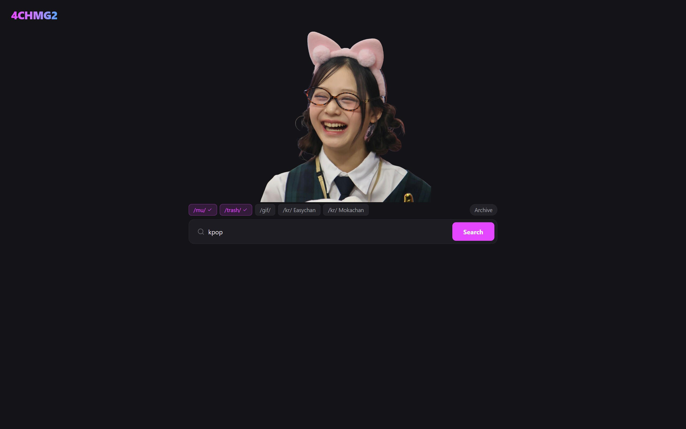
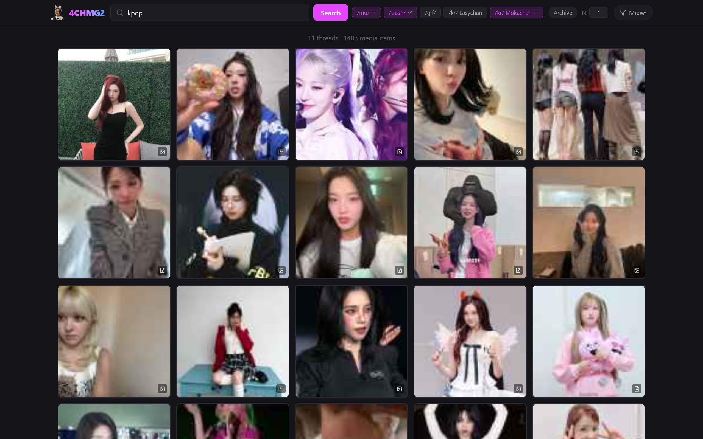
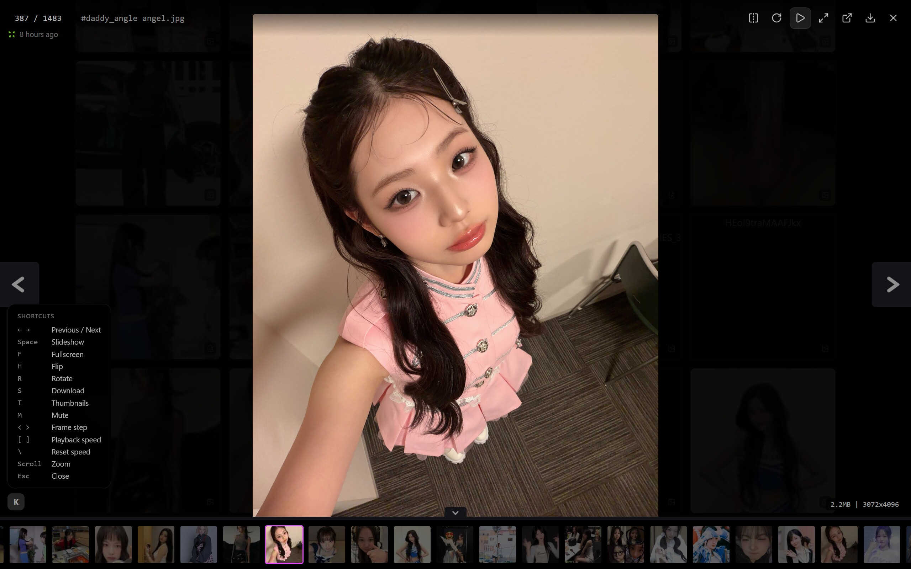

<p align="center">
  
</p>

<h1 align="center">4CHMG2</h1>

<p align="center">
  <b>4chan Media Gallery 2.0</b><br>
  <i>A cross-imageboard media aggregator and gallery viewer</i>
</p>

<p align="center">
  
  
  
</p>

---

Search by keyword across multiple imageboards simultaneously and browse all matching media in a unified gallery with a full-featured lightbox viewer.

<p align="center">
  
</p>

## ✨ Features

- [x] **Multi-board search** — Query 4chan, easychan, mokachan, and desuarchive at once
- [x] **Unified gallery grid** — All results merged and sorted by timestamp
- [x] **Full-featured lightbox** — Keyboard navigation, zoom/pan, slideshow, flip, download
- [x] **Cloudflare bypass** — FlareSolverr integration for protected boards
- [x] **OR search** — Separate keywords with `|` for multi-term matching
- [x] **Auto-refresh** — Load in fresh media without losing your place
- [x] **Touch-friendly** — Drag-to-pan, pinch-to-zoom, double-tap reset

<p align="center">
  
</p>

<p align="center">
  
</p>

## 🌐 Supported Boards

| Source | Board | Cloudflare | Format |
|:------:|:-----:|:----------:|:------:|
| 4chan | /mu/, /trash/, /gif/ | No | 4chan API |
| Easychan | /kr/ | Yes | Meguca |
| Mokachan | /kr/ | No | Meguca |
| Desuarchive | /mu/, /trash/ | No | Foolfuuka |

Adding a new board is a single config entry in `src/lib/boards.ts`.

## 🎮 Lightbox Hotkeys

| Key | Action |
|:---:|:------:|
| `←` / `→` | Navigate between media |
| `Space` | Toggle slideshow |
| `F` | Toggle fullscreen |
| `H` | Flip image horizontally |
| `S` | Download current media |
| `R` | Rotate |
| `Esc` | Close lightbox |

## 🚀 Quick Start

### Local Development

Run the app directly without pm2 — ideal for development or quick testing:

```bash
git clone https://github.com/kpg-anon/4chmg2.git
cd 4chmg2
cp .env.example .env
nano .env                    # set your port, FlareSolverr URL, etc.
npm install
npm run build
npm start
```

### Persistent Server (pm2 + gulp)

Use pm2 for process management with automatic restarts and zero-downtime reloads:

```bash
git clone https://github.com/kpg-anon/4chmg2.git
cd 4chmg2
cp .env.example .env
nano .env                    # set your domain, port, etc.
npm install
npx gulp reset               # install, build, and start pm2
```

### VPS Deployment (Debian 12)

For a full production setup with nginx, SSL, FlareSolverr, and pm2 autostart:

```bash
sudo ./install.sh
```

See **[INSTALLATION.md](docs/INSTALLATION.md)** for the complete walkthrough.

## 🧑‍💻 Usage

After making changes to the code:

```bash
# Local development
npm run build && npm start

# pm2 managed server
npx gulp                     # build + reload (everyday command)
./build_restart.sh           # same thing, scriptable
```

| Command | Description |
|---------|-------------|
| `npx gulp` | Build and reload server |
| `npx gulp build` | Build only |
| `npx gulp restart` | Reload pm2 only |
| `npx gulp reset` | Full setup from scratch |
| `npx gulp logs` | View application logs |
| `npx gulp status` | Check pm2 process status |

## 🛠️ Tech Stack

| Layer | Technology |
|-------|-----------|
| Framework | Next.js 16 (App Router) |
| Language | TypeScript |
| Runtime | React 19 |
| Styling | Tailwind CSS v4 |
| Process Manager | pm2 |
| Build Runner | gulp |
| Reverse Proxy | nginx + certbot |
| Cloudflare Bypass | FlareSolverr |

## 📦 Deployment

4CHMG2 is designed to be self-hosted. Instance-specific configuration (domain, ports, etc.) lives in `.env` which is gitignored. For VPS deployment details, see **[INSTALLATION.md](docs/INSTALLATION.md)**.

## 📝 TODO

- [ ] User accounts and saved searches
- [ ] Additional imageboard sources
- [ ] Media deduplication (perceptual hash)
- [ ] Gallery sharing via URL

## License

MIT
