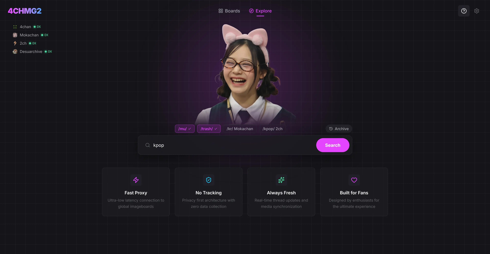
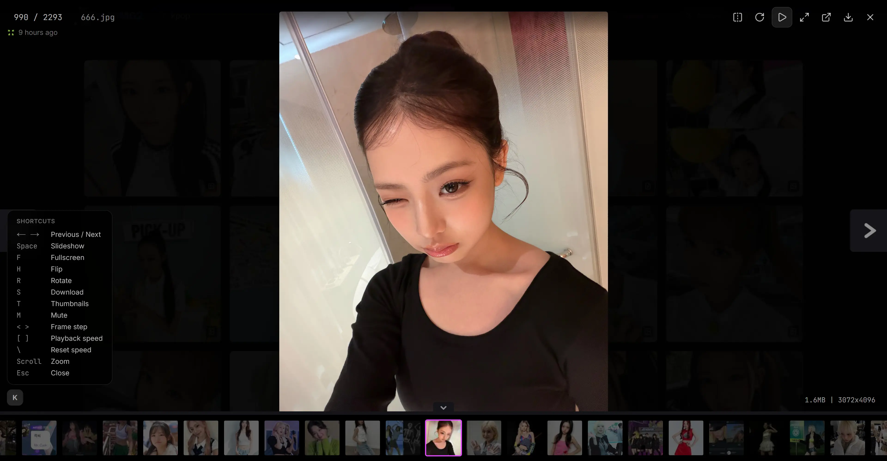
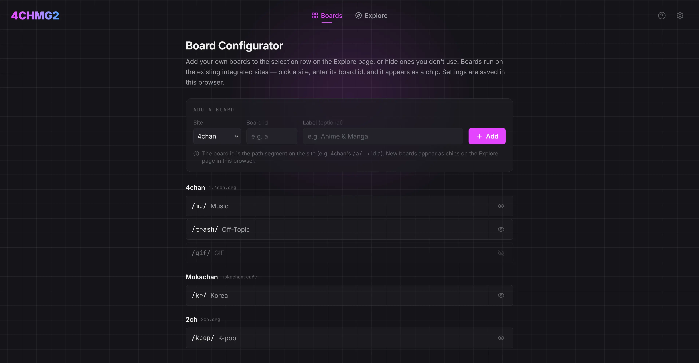

<!-- ───────────────────────────── HERO ───────────────────────────── -->
<div align="center">


<h1>
  <samp>4CHMG2</samp>
</h1>

<p>
  <b>4chan Media Gallery 2.0 — a cross-imageboard media aggregator and gallery viewer.</b><br>
  <i>Search one keyword. Get every matching image and video from every board, merged into one fast gallery.</i>
</p>

<p>
  
  
  
</p>

<p>
  
  
  
  
</p>



<sub><i>The redesigned "deep space utility" homepage — live source-status panel, neon accents, and a single search box.</i></sub>

</div>

---

> [!NOTE]
> **v1.4.0.** New this release: **auto-refresh** with a "new posts" divider that merges in smoothly, download-complete **toasts**, a **locate-on-exit** highlight that returns you to your place after closing the lightbox, fixed webp downloads, always-clockwise rotation, and pulsing live status dots. K-pop-oriented by default, general-purpose by design.

<!-- ───────────────────────────── TOC ───────────────────────────── -->
<details>
<summary><b>📖 Table of contents</b></summary>

- [Why 4CHMG2](#-why-4chmg2)
- [What's new in 1.4.0](#-whats-new-in-140)
- [Features](#-features)
- [Showcase](#-showcase)
- [Supported boards](#-supported-boards)
- [Lightbox hotkeys](#-lightbox-hotkeys)
- [Quick start](#-quick-start)
- [Usage](#-usage)
- [Tech stack](#-tech-stack)
- [Deployment](#-deployment)
- [Roadmap](#-roadmap)
- [License](#-license)

</details>

## ✨ Why 4CHMG2

Imageboards scatter the same media across a dozen boards and archives. Finding everything on a topic means opening tab after tab, scrolling thread after thread, and re-running the same search by hand. **4CHMG2 collapses that into one query.**

| | Principle | What it means |
|:--:|:--|:--|
| 🔎 | **Search once, see everything** | One keyword fans out across 4chan, 2ch.org, Mokachan, and Desuarchive in parallel. |
| 🖼️ | **One unified gallery** | All hits merge into a single grid, sorted newest-first by post timestamp. |
| ⚡ | **Fast by default** | A self-hosted proxy with aggressive thumbnail caching keeps scrolling smooth — no skeleton flashes. |
| 🎛️ | **Yours to configure** | Add, hide, or remove boards right in the browser — no source edits required. |

## 🚀 What's new in 1.4.0

- 🔄 **Auto-refresh** — toggle live polling of your open threads for new posts, with a **1m / 5m** interval (default 5m). Fresh media lands below a full-width **"new posts" divider**; successive batches stack below it and merge into the grid only when you scroll to the bottom — with a smooth slide-in animation instead of a layout jump.
- 🎯 **Locate-on-exit** — closing the lightbox smooth-scrolls the tile you were viewing back to centre and highlights it (a cyan pulse plus a full-bleed band across its row, fading out) so you never lose your place.
- ✅ **Download-complete toasts** — green-check "*filename* saved" notifications slide in, stack, and fade out on both the search and lightbox views, tucked out of the way of the thumbnail strip.
- 💾 **Fixed webp downloads** — webp now saves like every other format instead of opening in a new tab.
- 🔁 **Always-clockwise rotation** — rotate reads clockwise even after a horizontal flip, and flipping no longer "rewinds" your rotation.
- 🟢 **Live status dots** — the home-page source-status dots pulse to signal live data.
- 🧭 **More orienting controls** — a scroll-to-bottom button, mouse-wheel scrolling on the lightbox thumbnail strip, centred-then-cursor-following zoom, and <kbd>Ctrl</kbd>+<kbd>F</kbd> to filter by filename.

## 🧰 Features

<details open>
<summary><b>Feature checklist</b></summary>

- [x] **Multi-board search** — query 4chan, 2ch.org, Mokachan, and Desuarchive simultaneously
- [x] **Unified gallery grid** — all results merged and sorted by timestamp
- [x] **Batch ZIP downloads** — select gallery results and export them as a single archive
- [x] **Quick save** — hover a result and press <kbd>S</kbd> to download it in place
- [x] **Full-featured lightbox** — keyboard nav, zoom/pan, slideshow, flip, rotate, download, hotkeys
- [x] **OR search** — separate keywords with <kbd>|</kbd> for multi-term matching
- [x] **Auto-refresh** — toggleable live polling with a "new posts" divider that merges in smoothly when you reach the bottom
- [x] **Download toasts** — slide-in "saved" confirmations that stack and fade
- [x] **Locate-on-exit** — smooth-scroll + highlight returns you to your place after closing the lightbox
- [x] **Touch-friendly** — drag-to-pan, pinch-to-zoom, double-tap reset
- [x] **Fast self-hosted proxy** — aggressive thumbnail caching for smooth, flash-free scrolling
- [x] **In-browser Board Configurator** — add / hide / delete boards, persisted per-browser
- [x] **Relative-time scrollbar** — scrub a result set by post time
- [x] **Dock-style lightbox thumbnails** — cursor-following magnification

</details>

## 🖼️ Showcase

<table>
  <tr>
    <td align="center" width="50%">
      <br>
      <sub><b>Unified search gallery</b> — every board's hits in one timeline-sorted grid.</sub>
    </td>
    <td align="center" width="50%">
      <br>
      <sub><b>Lightbox viewer</b> — zoom, pan, slideshow, and a magnifying dock.</sub>
    </td>
  </tr>
</table>

<details>
<summary><b>🎛️ In-browser Board Configurator</b></summary>

<p align="center">
  <br>
  <sub>Add your own boards by id + label, hide ones you don't use, or delete them — all without editing source code.</sub>
</p>

</details>

## 🌐 Supported boards

| Source | Board(s) | Cloudflare | Format |
|:--|:--|:--:|:--|
| **4chan** | /mu/, /trash/, /gif/ | No | 4chan API |
| **2ch.org** (Dvach) | /kpop/ | No | Dvach / Vichan |
| **Mokachan** | /kr/ | No | Meguca |
| **Desuarchive** | /mu/, /trash/ | No | Foolfuuka |
| ~~Easychan (defunct)~~ | ~~/kr/~~ | ~~Yes~~ | ~~Meguca~~ |

> [!TIP]
> Users can add their own boards on the supported sites via the in-app **Board Configurator** — no source edits needed. Adding a new *built-in default* is still a single entry in [`src/lib/boards.ts`](src/lib/boards.ts).

<details>
<summary><b>A note on Cloudflare</b></summary>

Cloudflare-bypass support (FlareSolverr) is **retained in code** for future Cloudflare-fronted boards, but is **not deployed in production** — the only board that ever needed it, Easychan, is defunct. It is dormant, not a headline feature.

</details>

## 🎮 Lightbox hotkeys

| Key | Action |
|:--|:--|
| <kbd>←</kbd> / <kbd>→</kbd> | Navigate between media |
| <kbd>Space</kbd> | Toggle slideshow |
| <kbd>F</kbd> | Toggle fullscreen |
| <kbd>H</kbd> | Flip image horizontally |
| <kbd>R</kbd> | Rotate |
| <kbd>S</kbd> | Download current media |
| <kbd>T</kbd> | Toggle thumbnail strip |
| <kbd>M</kbd> | Mute / unmute video |
| <kbd>Esc</kbd> | Close lightbox |

## 🚀 Quick start

### Local development

Run the app directly without pm2 — ideal for development or quick testing:

```bash
git clone https://github.com/kpg-anon/4chmg2.git
cd 4chmg2
cp .env.example .env
nano .env                    # set your port, etc.
npm install
npm run build
npm start
```

### Persistent server (pm2 + gulp)

Use pm2 for process management with automatic restarts and zero-downtime reloads:

```bash
git clone https://github.com/kpg-anon/4chmg2.git
cd 4chmg2
cp .env.example .env
nano .env                    # set your domain, port, etc.
npm install
npx gulp reset               # install, build, and start under pm2
```

### VPS deployment (Debian 12)

For a full production setup with nginx, SSL (certbot), and pm2 autostart:

```bash
sudo ./install.sh
```

See **[docs/INSTALLATION.md](docs/INSTALLATION.md)** for the complete walkthrough.

## 🧑‍💻 Usage

After making changes to the code:

```bash
npx gulp                     # build + reload (everyday command)
```

| Command | Description |
|:--|:--|
| `npx gulp` | Build and reload the server |
| `npx gulp build` | Build only |
| `npx gulp restart` | Reload pm2 only |
| `npx gulp reset` | Full setup from scratch (install + build + start) |
| `npx gulp logs` | View application logs |
| `npx gulp status` | Check pm2 process status |

## 🛠️ Tech stack

| Layer | Technology |
|:--|:--|
| Framework | Next.js 16 (App Router) |
| Runtime | React 19 |
| Language | TypeScript |
| Styling | Tailwind CSS v4 |
| Process manager | pm2 |
| Build runner | gulp |
| Reverse proxy | nginx + certbot |

<sub>Cloudflare-bypass (FlareSolverr) support is retained in code for future Cloudflare-fronted boards, but is dormant and not deployed in production.</sub>

## 📦 Deployment

4CHMG2 is designed to be self-hosted. Instance-specific configuration (domain, ports, etc.) lives in `.env`, which is gitignored. For full VPS deployment details, see **[docs/INSTALLATION.md](docs/INSTALLATION.md)**.

## 🗺️ Roadmap

- [ ] Additional imageboard sources
- [ ] Media deduplication via perceptual hash
- [ ] Gallery sharing via URL
- [ ] Expanded settings (grid density, accent color)

## 📜 License

[MIT](LICENSE)

---

<div align="center">
<sub>Built with <a href="https://nextjs.org">Next.js</a>, <a href="https://react.dev">React</a>, and <a href="https://tailwindcss.com">Tailwind CSS</a>.</sub>
</div>
